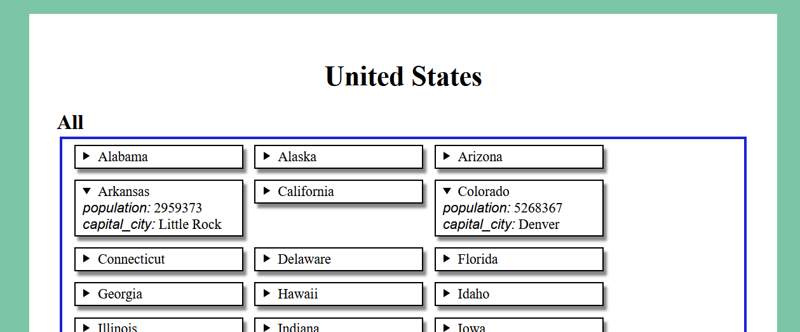
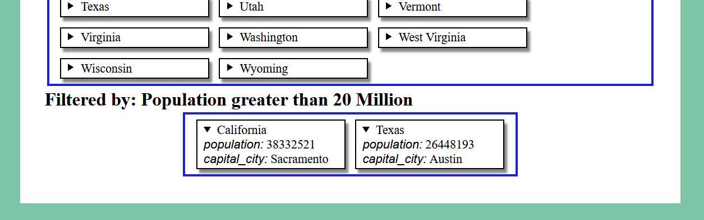

# Question 1 United States Visualization (25 pts, Variant C)

You are developing a component for a React based App to help middle school students learn about the states in the US. The `index.html`, `index.js`, and styling (`question1.css`) files have been completed for you. You just need to develop the React component specified below. *Note*: **No** credit can be given for an App that doesn't build with the Parcel.js bundler.

You are provided with the following files:

* An `index.html`. **This cannot be modified.**

* A `index.js` file containing the main React App. **This cannot be modified.** Your component must be compatible with this file, i.e., this file will be importing and using your component.

* A `question1.css` CSS file that contains all the CSS for the site. This **cannot** be modified.

* A `states.json` file which contains information about the states in the US. This **cannot** be modified or imported into your components. This data is passed to your component as a *prop*.

You will deliver to me one JavaScript file for a "StateViewer" React component you will create. This file must implement the functionality described below. Screenshots of the finished App are shown below.

## (a) Create Compatible JavaScript File and React Functional Component (5 pts)

* Create a JavaScript file for the component compatible with that imported in the `index.js` file.
* Create the appropriately named (compatible with `index.js`) React *functional* component in this file.
* Return a `<section>` element (can be empty to start) with the `class` attribute set to *StateViewer*. You will add content to this `<section>` in the following parts.

## (b) Details and Summary (5 pts)

* For each state entry in the `states` prop passed to your *StateViewer* component produce and display a `
` HTML element.
* Within each `
` add an `
` element containing the name of the state. See the `state` field in the JSON objects in the `states.json` array.

## (c) Data Label and Field (5 pts)

* Within the `
` element add paragraph elements to show the **population** and **capital_city** fields from each state.
* Add a `<label>` element into the paragraph to describe the field.
* Your results should look like the top screenshot shown above.

## (d) Filtered version of the Component (10 pts)

If you look at the `index.js` file you will see that the `StateViewer` component is
called twice. In the second called the *filter* attribute is set to *true*.

* When the *filter* attribute is set to *true* have your component only show items that satisfy *Population greater than 20 Million*.

This should produce a result similar to the second screenshot.
