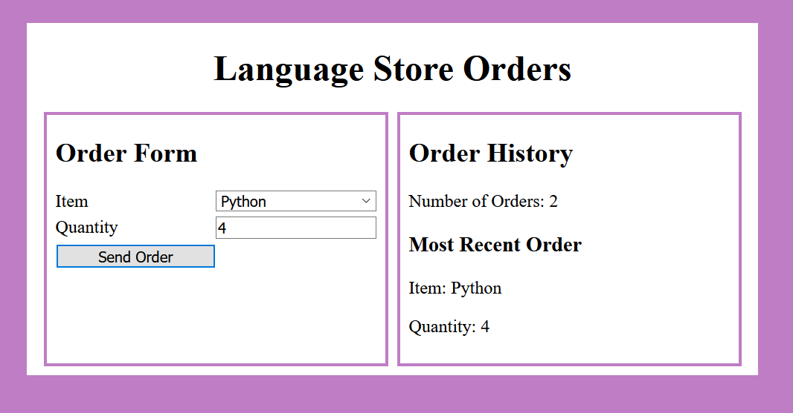

# Question 2 Interactive React Component (25 pts)

You are starting work on a React based App for order management at the **Language Store**. The layout and styling has been done for you. As shown below:



You are provided with the following files:

* An `index.html` This cannot be modified.

* A `index.js` file containing the main React App. This shows the *order* history on the right side of the App page. You are **only allowed to modify** this file in *two* locations as indicated in comments in the file.

* A `question2.css` CSS file that contains all the CSS for the site. This cannot be modified.

You will create/modify **two** files:

* A new file for the React component you are asked to create (shown on the left side of the screenshot above)
* An updated `index.js` React App, where only limited changes are allowed as specified in the comments in the file.

These files must implement the functionality described below.

## (a) Create Files and an Empty *Order* Component (5 pts)

Get your *Parcel.js* build working by:

* Creating the new JavaScript file to hold the **Order** component. The file name must be compatible with that in the `index.js` file.
* Creating the appropriately name React *class* **Order** component in that file. This component can just render an empty `<div>` at this point
* Exporting the component in the appropriate way so that the `index.js` file can import it.

You must have a clean Parcel.js build at this point and in all the following parts to receive credit.

## (b) Component Mockup (5 pts)

The Language Store only caries the following items: "JavaScript", "Python", "Rust", "Go".
You will now give the *Order* component, shown on the left side of the top figure the functionality indicated below:

* It returns a `<div>` element containing the following
* An `<h2>` element containing the form title
* A `<div id="OrderForm">` element that will hold labels, text area, inputs, and button. This will receive grid styling from the style sheet (do not change or add styling).
* An `<select>` element for choosing the *item* to order. *Hint*: Within the select use elements like `<option value="Some Option">Some Option</option>`.
* An, `<input>` element for specify the *quantity* of the *item* (this can just be a string)
* A *Send Order* button

***Note***: Your component does not need to update the select, input, or respond to button click to receive these points.

## (c) State and Event Handling (10 pts)

You will now give the *Order* component, shown on the left side of the top figure, the following additional functionality:

* Changes to the select and input elements update the component state. Hint: use `onChange` to specify the event handler and `event.target.value` to retrieve the value.
* On the click of *Send Order* button you will log the components state to the developers console.

## (d) Update Parent Components *Orders* Array (5 pts)

* On the click of *Send Order* button in addition to what you did in part (c) you need to add this *order* to the array of **orders** kept by the ***App*** in the `index.js` file. The *orders* array holds objects of the form:

```javascript
{item: "Item Name", quantity: "string for number"}
```

* You are allowed to modify the `index.js` in two places to help you do this.
